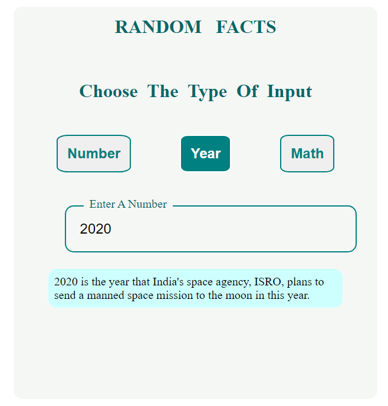

# Facts About Numbers
**Learn some facts about numbers and years**
#### version 1.0.0

## Table of Contents
- [General info](#general-info)
- [Manual](#manual)
- [Technologies](#technologies)
- [Inspiration](#inspiration)
- [License](#license)

## General info
Based on [**numbersapi.com**](http://numbersapi.com/) API, this website Generates random facts about numbers and years.

## Manual
This project generates three types of facts

* number : general facts.
* year :       interesting events.
* math : mathematical facts.

## Technologies

 - React  : ^16.13.1
 - Sass    : ^4.14.1

    you can see all dependencies from **[package.json](package.json)**

## Inspiration
This project inspired by [Vanilla JS Number Facts App - Ajax & Fetch](https://www.youtube.com/watch?v=tUE2Nic21BA&t=3s) video from [**Traversy Media**](https://www.youtube.com/c/TraversyMedia/featured)  Youtube channel.
The original uses vanilla JavaScript. This has been convered into React.

> This is a practice to what I learned about **React** & **React Hooks**.

## License

- Licensed under the **[MIT license](LICENSE)**
- Copyright (c) 2020 Mohamed Hafez
